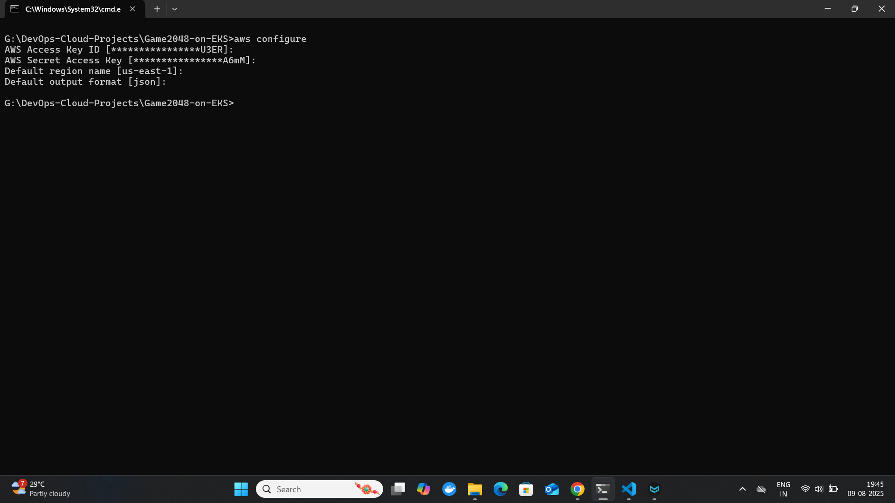
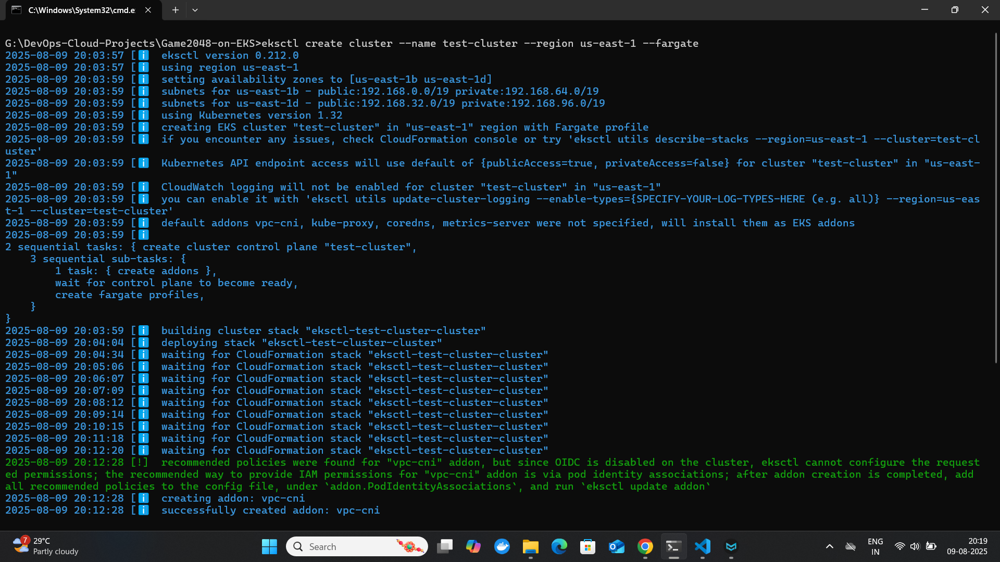
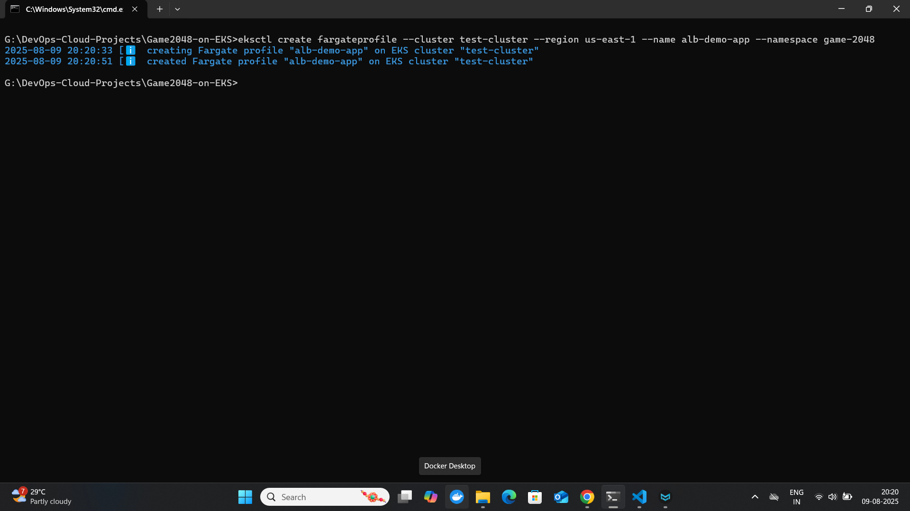
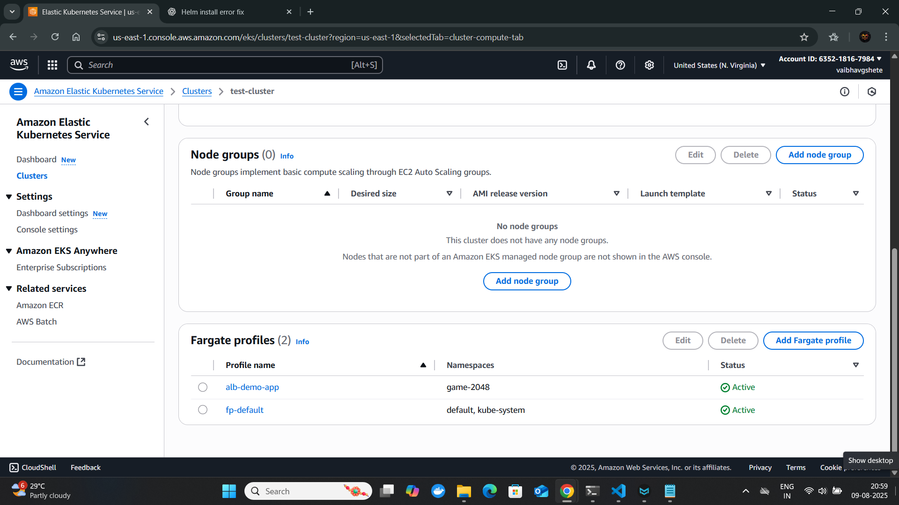
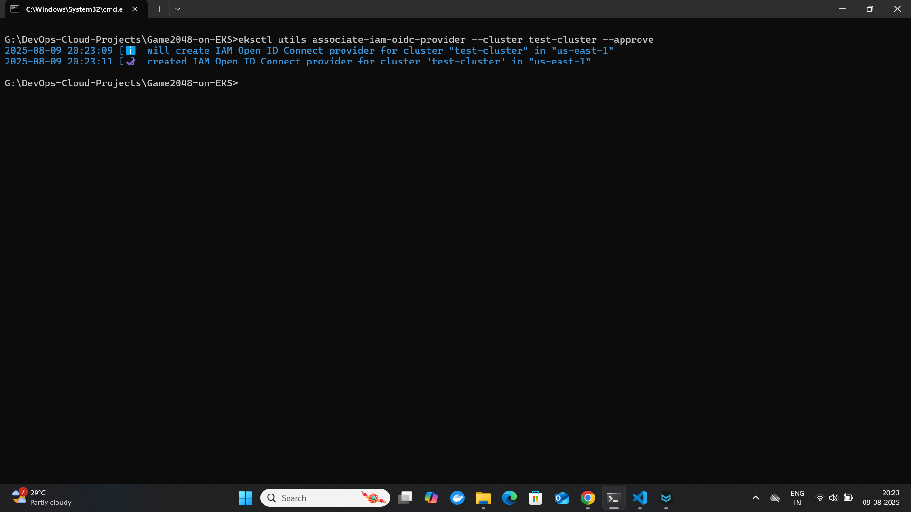
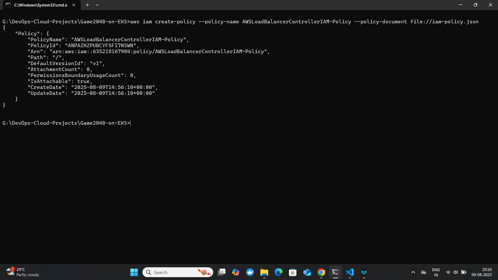
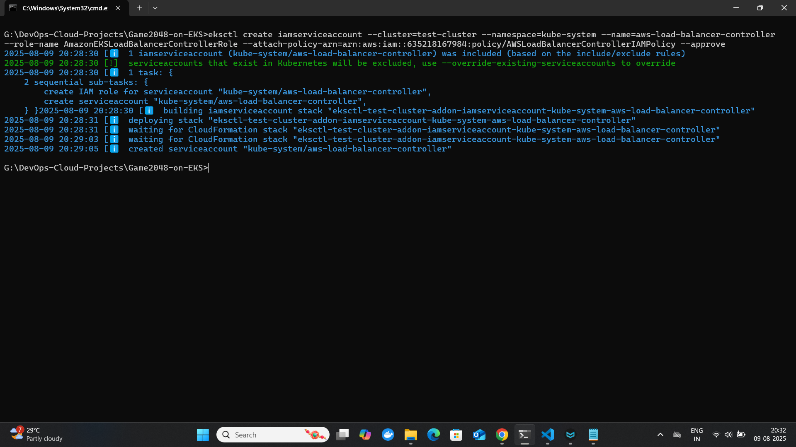
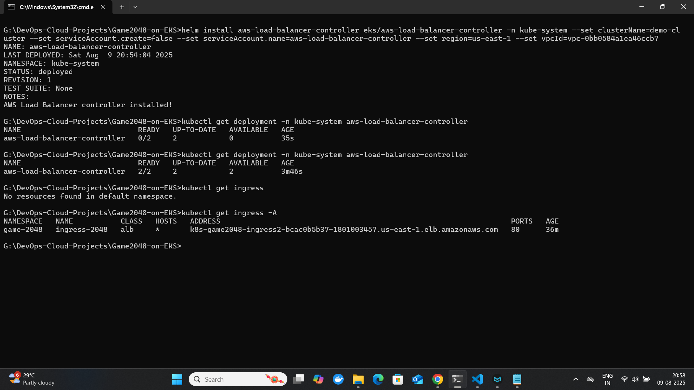
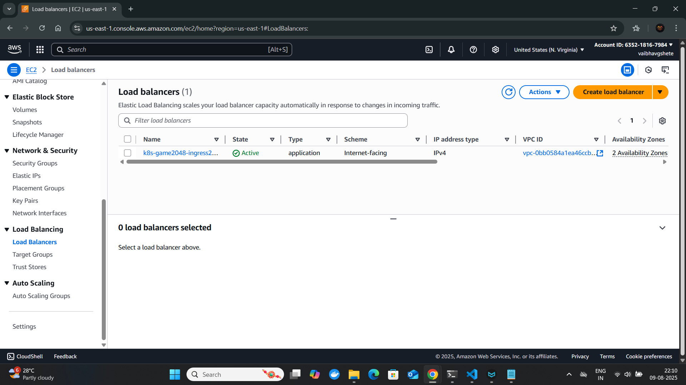
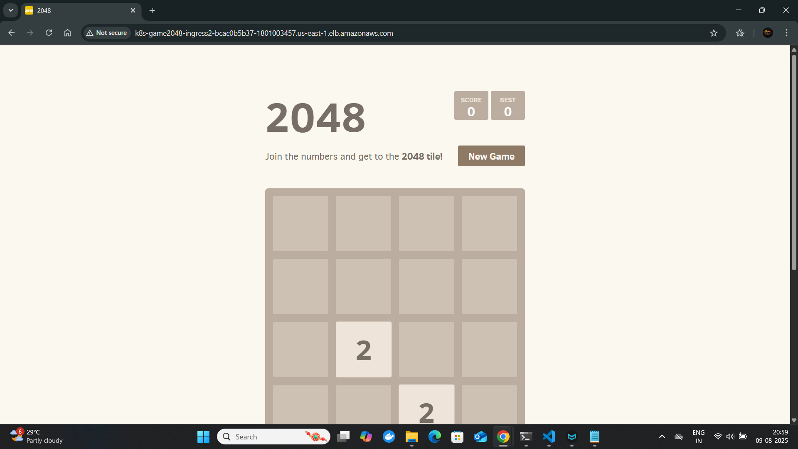

# 🎮 Game 2048 Deployment on AWS EKS (Fargate)

This project demonstrates how to deploy the **Game 2048** web application on **Amazon EKS** using **Fargate** with a fully configured **AWS Load Balancer Controller**. It includes Kubernetes manifests, IAM role setup, and an Ingress-based URL for public access.

---

## 📌 Tech Stack

- **AWS EKS** (Elastic Kubernetes Service)
- **Fargate** (Serverless compute for pods)
- **IAM OIDC Provider**
- **AWS Load Balancer Controller**
- **Helm**
- **kubectl**
- **eksctl**
- **Ingress**
- **YAML**

---

## 🚀 Prerequisites

Make sure the following tools are installed:

- [AWS CLI](https://docs.aws.amazon.com/cli/latest/userguide/install-cliv2.html)
- [eksctl](https://eksctl.io/introduction/#installation)
- [kubectl](https://kubernetes.io/docs/tasks/tools/)
- [Helm](https://helm.sh/docs/intro/install/)

---

## 🔧 Setup & Deployment Steps

### 1. Configure AWS CLI

```bash
aws configure
```

### 2. Create an EKS Cluster with Fargate

```bash
eksctl create cluster --name test-cluster --region us-east-1 --fargate
```

---

### 3. Create a Fargate Profile

```bash
eksctl create fargateprofile --cluster test-cluster --region us-east-1 --name alb-demo-app --namespace game-2048
```

---

### 4. Deploy Game-2048 on EKS Cluster

- We are using docker image `public.ecr.aws/l6m2t8p7/docker-2048:latest`. Which already have completed containerize 2048 application.

- To deploy on kubernetes cluster we are using following full YAML file
  
  ```yaml
  ---
  apiVersion: v1
  kind: Namespace
  metadata:
    name: game-2048
  ---
  apiVersion: apps/v1
  kind: Deployment
  metadata:
    namespace: game-2048
    name: deployment-2048
  spec:
    selector:
      matchLabels:
        app.kubernetes.io/name: app-2048
    replicas: 5
    template:
      metadata:
        labels:
          app.kubernetes.io/name: app-2048
      spec:
        containers:
        - image: public.ecr.aws/l6m2t8p7/docker-2048:latest
          imagePullPolicy: Always
          name: app-2048
          ports:
          - containerPort: 80
  ---
  apiVersion: v1
  kind: Service
  metadata:
    namespace: game-2048
    name: service-2048
  spec:
    ports:
      - port: 80
        targetPort: 80
        protocol: TCP
    type: NodePort
    selector:
      app.kubernetes.io/name: app-2048
  ---
  apiVersion: networking.k8s.io/v1
  kind: Ingress
  metadata:
    namespace: game-2048
    name: ingress-2048
    annotations:
      alb.ingress.kubernetes.io/scheme: internet-facing
      alb.ingress.kubernetes.io/target-type: ip
  spec:
    ingressClassName: alb
    rules:
      - http:
          paths:
          - path: /
            pathType: Prefix
            backend:
              service:
                name: service-2048
                port:
                  number: 80
  ```

- Command: `kubetctl apply -f 2048_full.yaml`

### 4. Associate IAM OIDC Provider

**What is OIDC?**  
OpenID Connect (OIDC) is an identity layer on top of OAuth 2.0.  
In EKS, OIDC is used to allow Kubernetes service accounts to assume IAM roles securely without hardcoding AWS credentials into pods.

```bash
eksctl utils associate-iam-oidc-provider --cluster test-cluster --approve
```

---

### 5. Create IAM Policy for Load Balancer Controller

we are using following IAM policy :

```json
{
    "Version": "2012-10-17",
    "Statement": [
        {
            "Effect": "Allow",
            "Action": [
                "iam:CreateServiceLinkedRole"
            ],
            "Resource": "*",
            "Condition": {
                "StringEquals": {
                    "iam:AWSServiceName": "elasticloadbalancing.amazonaws.com"
                }
            }
        },
        {
            "Effect": "Allow",
            "Action": [
                "ec2:DescribeAccountAttributes",
                "ec2:DescribeAddresses",
                "ec2:DescribeAvailabilityZones",
                "ec2:DescribeInternetGateways",
                "ec2:DescribeVpcs",
                "ec2:DescribeVpcPeeringConnections",
                "ec2:DescribeSubnets",
                "ec2:DescribeSecurityGroups",
                "ec2:DescribeInstances",
                "ec2:DescribeNetworkInterfaces",
                "ec2:DescribeTags",
                "ec2:GetCoipPoolUsage",
                "ec2:DescribeCoipPools",
                "ec2:GetSecurityGroupsForVpc",
                "elasticloadbalancing:DescribeLoadBalancers",
                "elasticloadbalancing:DescribeLoadBalancerAttributes",
                "elasticloadbalancing:DescribeListeners",
                "elasticloadbalancing:DescribeListenerCertificates",
                "elasticloadbalancing:DescribeSSLPolicies",
                "elasticloadbalancing:DescribeRules",
                "elasticloadbalancing:DescribeTargetGroups",
                "elasticloadbalancing:DescribeTargetGroupAttributes",
                "elasticloadbalancing:DescribeTargetHealth",
                "elasticloadbalancing:DescribeTags",
                "elasticloadbalancing:DescribeTrustStores",
                "elasticloadbalancing:DescribeListenerAttributes",
                "elasticloadbalancing:DescribeCapacityReservation"
            ],
            "Resource": "*"
        },
        {
            "Effect": "Allow",
            "Action": [
                "cognito-idp:DescribeUserPoolClient",
                "acm:ListCertificates",
                "acm:DescribeCertificate",
                "iam:ListServerCertificates",
                "iam:GetServerCertificate",
                "waf-regional:GetWebACL",
                "waf-regional:GetWebACLForResource",
                "waf-regional:AssociateWebACL",
                "waf-regional:DisassociateWebACL",
                "wafv2:GetWebACL",
                "wafv2:GetWebACLForResource",
                "wafv2:AssociateWebACL",
                "wafv2:DisassociateWebACL",
                "shield:GetSubscriptionState",
                "shield:DescribeProtection",
                "shield:CreateProtection",
                "shield:DeleteProtection"
            ],
            "Resource": "*"
        },
        {
            "Effect": "Allow",
            "Action": [
                "ec2:AuthorizeSecurityGroupIngress",
                "ec2:RevokeSecurityGroupIngress"
            ],
            "Resource": "*"
        },
        {
            "Effect": "Allow",
            "Action": [
                "ec2:CreateSecurityGroup"
            ],
            "Resource": "*"
        },
        {
            "Effect": "Allow",
            "Action": [
                "ec2:CreateTags"
            ],
            "Resource": "arn:aws:ec2:*:*:security-group/*",
            "Condition": {
                "StringEquals": {
                    "ec2:CreateAction": "CreateSecurityGroup"
                },
                "Null": {
                    "aws:RequestTag/elbv2.k8s.aws/cluster": "false"
                }
            }
        },
        {
            "Effect": "Allow",
            "Action": [
                "ec2:CreateTags",
                "ec2:DeleteTags"
            ],
            "Resource": "arn:aws:ec2:*:*:security-group/*",
            "Condition": {
                "Null": {
                    "aws:RequestTag/elbv2.k8s.aws/cluster": "true",
                    "aws:ResourceTag/elbv2.k8s.aws/cluster": "false"
                }
            }
        },
        {
            "Effect": "Allow",
            "Action": [
                "ec2:AuthorizeSecurityGroupIngress",
                "ec2:RevokeSecurityGroupIngress",
                "ec2:DeleteSecurityGroup"
            ],
            "Resource": "*",
            "Condition": {
                "Null": {
                    "aws:ResourceTag/elbv2.k8s.aws/cluster": "false"
                }
            }
        },
        {
            "Effect": "Allow",
            "Action": [
                "elasticloadbalancing:CreateLoadBalancer",
                "elasticloadbalancing:CreateTargetGroup"
            ],
            "Resource": "*",
            "Condition": {
                "Null": {
                    "aws:RequestTag/elbv2.k8s.aws/cluster": "false"
                }
            }
        },
        {
            "Effect": "Allow",
            "Action": [
                "elasticloadbalancing:CreateListener",
                "elasticloadbalancing:DeleteListener",
                "elasticloadbalancing:CreateRule",
                "elasticloadbalancing:DeleteRule"
            ],
            "Resource": "*"
        },
        {
            "Effect": "Allow",
            "Action": [
                "elasticloadbalancing:AddTags",
                "elasticloadbalancing:RemoveTags"
            ],
            "Resource": [
                "arn:aws:elasticloadbalancing:*:*:targetgroup/*/*",
                "arn:aws:elasticloadbalancing:*:*:loadbalancer/net/*/*",
                "arn:aws:elasticloadbalancing:*:*:loadbalancer/app/*/*"
            ],
            "Condition": {
                "Null": {
                    "aws:RequestTag/elbv2.k8s.aws/cluster": "true",
                    "aws:ResourceTag/elbv2.k8s.aws/cluster": "false"
                }
            }
        },
        {
            "Effect": "Allow",
            "Action": [
                "elasticloadbalancing:AddTags",
                "elasticloadbalancing:RemoveTags"
            ],
            "Resource": [
                "arn:aws:elasticloadbalancing:*:*:listener/net/*/*/*",
                "arn:aws:elasticloadbalancing:*:*:listener/app/*/*/*",
                "arn:aws:elasticloadbalancing:*:*:listener-rule/net/*/*/*",
                "arn:aws:elasticloadbalancing:*:*:listener-rule/app/*/*/*"
            ]
        },
        {
            "Effect": "Allow",
            "Action": [
                "elasticloadbalancing:ModifyLoadBalancerAttributes",
                "elasticloadbalancing:SetIpAddressType",
                "elasticloadbalancing:SetSecurityGroups",
                "elasticloadbalancing:SetSubnets",
                "elasticloadbalancing:DeleteLoadBalancer",
                "elasticloadbalancing:ModifyTargetGroup",
                "elasticloadbalancing:ModifyTargetGroupAttributes",
                "elasticloadbalancing:DeleteTargetGroup",
                "elasticloadbalancing:ModifyListenerAttributes",
                "elasticloadbalancing:ModifyCapacityReservation"
            ],
            "Resource": "*",
            "Condition": {
                "Null": {
                    "aws:ResourceTag/elbv2.k8s.aws/cluster": "false"
                }
            }
        },
        {
            "Effect": "Allow",
            "Action": [
                "elasticloadbalancing:AddTags"
            ],
            "Resource": [
                "arn:aws:elasticloadbalancing:*:*:targetgroup/*/*",
                "arn:aws:elasticloadbalancing:*:*:loadbalancer/net/*/*",
                "arn:aws:elasticloadbalancing:*:*:loadbalancer/app/*/*"
            ],
            "Condition": {
                "StringEquals": {
                    "elasticloadbalancing:CreateAction": [
                        "CreateTargetGroup",
                        "CreateLoadBalancer"
                    ]
                },
                "Null": {
                    "aws:RequestTag/elbv2.k8s.aws/cluster": "false"
                }
            }
        },
        {
            "Effect": "Allow",
            "Action": [
                "elasticloadbalancing:RegisterTargets",
                "elasticloadbalancing:DeregisterTargets"
            ],
            "Resource": "arn:aws:elasticloadbalancing:*:*:targetgroup/*/*"
        },
        {
            "Effect": "Allow",
            "Action": [
                "elasticloadbalancing:SetWebAcl",
                "elasticloadbalancing:ModifyListener",
                "elasticloadbalancing:AddListenerCertificates",
                "elasticloadbalancing:RemoveListenerCertificates",
                "elasticloadbalancing:ModifyRule"
            ],
            "Resource": "*"
        }
    ]
}
```

Create the IAM policy:

```bash
aws iam create-policy --policy-name AWSLoadBalancerControllerIAM-Policy --policy-document file://iam-policy.json
```

---

### 6. Create IAM Role for Load Balancer Controller

Replace placeholders as needed.

```bash
eksctl create iamserviceaccount \
  --cluster=test-cluster \
  --namespace=kube-system \
  --name=aws-load-balancer-controller \
  --role-name AmazonEKSLoadBalancerControllerRole \
  --attach-policy-arn=arn:aws:iam::<your-aws-account-id>:policy/AWSLoadBalancerControllerIAMPolicy \
  --approve
```

---

### 7. Install AWS Load Balancer Controller using Helm

Add and update the Helm repo:

```bash
helm repo add eks https://aws.github.io/eks-charts
helm repo update eks
```

Install the controller:

```bash
helm install aws-load-balancer-controller eks/aws-load-balancer-controller \
  -n kube-system \
  --set clusterName=test-cluster \
  --set serviceAccount.create=false \
  --set serviceAccount.name=aws-load-balancer-controller \
  --set region=us-east-1 \
  --set vpcId=<your-vpc-id>
```

---

### 8. Verify Deployment

Make sure the deployment is running successfully.

```bash
kubectl get deployment -n kube-system aws-load-balancer-controller
```

---

### 🌐 Access the Application

Once the Ingress and Load Balancer are provisioned, access the Game 2048 using the generated **Load Balancer URL** in your browser.

---

## ✅ Result

You’ll have a fully working, publicly accessible **Game 2048** web app running on AWS EKS with:

- Serverless Fargate pods

- Ingress via AWS Load Balancer Controller

- IAM-secured access using OIDC

## Snapshots

### AWS Configure
- Configure AWS to work with AWS CLI


### Create Cluster
- Create AWS EKS cluster using eksctl


### Create Fargate Profile
- Create fargate profile using eksctl commands



### Associate IAM OIDC
- Associate IAM OIDC to cluster


### Create IAM Policy


### Create IAM Role
- Create IAM role for load balancer controller


### Install ALB Controller
- Install AWS Application Load Balancer



### Successfully Access An Application
- Successfully able to access application on Application Load Balancer Endpoint
